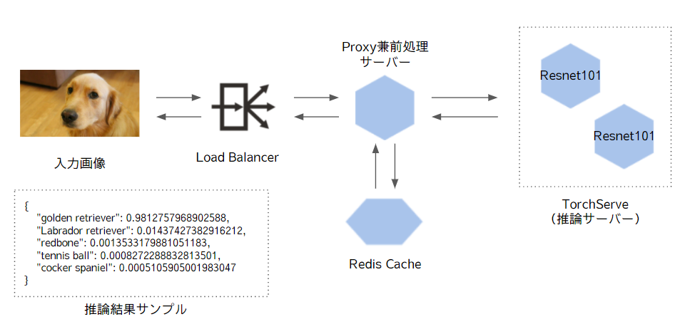

# MLOps学習用環境

## 概要

入力画像に対する推論結果をレスポンスするAPI

入力と推論結果をキャッシュするため、初回の推論は遅いが、2回目以降の推論結果のレスポンスは速くなる。

そのため以下のケースで有効なアーキテクチャ
- 同じリクエストが何度も送られてくるケース
- そのレスポンスを高速化したいケース





## ローカルに環境構築

```
$ git clone git@github.com:obt01/mlops01.git
$ cd mlops01
$ docker-compose -f docker-compose-torch.yml up -d
```

## テストリクエスト送信

```
$ curl "http://localhost:8010/predict/test"
$ curl "http://localhost:8010/predict" -F "file=@data/bobby.jpg"
```

最初に/predictへリクエストを送信するとレスポンスまで数秒かかるが、

この画像に対するレスポンスをRedisへキャッシュさせているためもう一度下記を実行するとすぐに返ってくる。

※/predict/testの結果はキャッシュしていないため毎回遅い

```
$ curl "http://localhost:8010/predict" -F "file=@data/bobby.jpg"
```


## TorchServeへ直接リクエストを送信する場合

```
$ curl http://host.docker.internal:8080/ping
$ curl http://host.docker.internal:8081/models
$ curl -X POST http://host.docker.internal:8080/predictions/resnet101 -F "file=@data/bobby.jpg"
```
